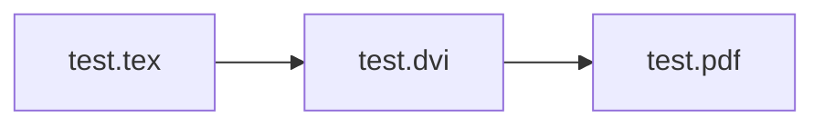

&nbsp;

:::message
今回の記事に対応する動画は以下からアクセスすることができます｡
__[TeX LiveとVSCodeをWindowsに導入して快適なLaTeX環境を構築する](https://togotv.dbcls.jp/20230301.html)__
:::
https://youtu.be/vKRxCpn2KbA?si=sqPKsRMgCgDwK_V6
:::message alert
本動画ではTeX Live 2022を用いています。2023年3月19日にTeX Live 2023がリリースされました。2022版と一部仕様変更があり、動画で紹介している内容が一部再現できなくなってるのでご注意ください。
:::


&nbsp;

# はじめに

:::message
__本記事の対象となる方__

■ $\LaTeX$を使ってレポートや論文を書きたい人
■ $\LaTeX$の執筆環境をローカルマシンに構築したい人
:::

この記事では、以下の2点をご紹介します。
__(1) WindowsマシンにTeX Liveを導入する__
__(2) VSCodeを用いてTeXファイルを編集、コンパイルする。__

&nbsp;

本記事を参考にすることで、ローカルマシンで$\LaTeX$の執筆やPDF作成を行えます。
OverleafやCloud LaTeXなどのオンラインサービスを使うこともできますが、安定したネット環境に接続していないと作業ができないというデメリットがあります。また、Overleafの無料ユーザーにはコンパイル時間のタイムリミットがあるため、大規模なファイルをコンパイルする際にはローカルマシンでの作業が必要になります。
参考：[Changes to free compile timeouts and servers](https://ja.overleaf.com/blog/changes-to-free-compile-timeouts-and-servers)

&nbsp;

# TeX Liveを導入する
今回はTeX Liveというソフトウェアをインストールして、$\LaTeX$環境を構築します。
現在、日本国内ではTeX Liveが最も普及していると思われます。
[日本語のWikiページ](https://texwiki.texjp.org/?TeX%20Live)や、各種解説記事も充実しているため、初心者の方でも導入しやすいと思います。今回解説する方法も、TeX Liveの公式サイトに掲載されている方法を参考にしています。

:::message alert
今回紹介する方法はネットワークインストーラを用います。インストールには安定したネットワーク接続が必要です。また、インストールには1時間から2時間ほどかかる場合があります。
ISOイメージを用いたインストール方法もありますので、ネットワーク接続が不安定な場合はそちらをご利用ください。
:::

### TeX Liveのインストーラーをダウンロードする
TeX Liveのインストーラーは、[Installing TeX Live over the Internet](https://www.tug.org/texlive/acquire-netinstall.html)からダウンロードすることができます。サイト内の `install-tl-windows.exe` をクリックしてダウンロードします。

### インストーラを開いてインストールの準備をする
インストーラを開く際に、`WindwosによってPCが保護されました` という警告が表示される場合があります。この場合は、`詳細情報` をクリックして、`実行` をクリックしてください。


ダウンロードしたインストーラを開くと、特定のミラーを選択する画面が表示されます。ここでは、`Asis` の項目で、`Japan` を選択します。これは、インストールするファイルをダウンロードするサーバーを選択するものです。日本国内のサーバーを選択することで、ダウンロード速度が向上します。

:::message alert
`Japan` 内のサイトであればどこでも構いませんが、セキュリティの観点から、`https://` から始まるものを選択することをおすすめします。
:::
&nbsp;
以下が、インストーラを開いた際の画面です。`TeXworksをインストール` からチェックを外します。今回はVSCodeを用いるため、TeXworksは不要です。また、`高度な設定` から詳細な設定を変更することができますが、デフォルトのままで問題ありません。


:::message
高度な設定からインストールするパッケージの量を変更することができます。デフォルトでは、`full スキーム（すべて）` となっています。このままでも問題ありませんが、インストール容量は多くなります。(7.5GBほど)
インストールするパッケージの量を減らしたい場合は適宜調整してください。
:::

:::message alert
`full スキーム（すべて）` 以外のものを選択した場合、日本語に対応させるパッケージが含まれていない場合があります。その場合は、`カスタマイズ` の言語欄から日本語を選択してください。
:::

## インストールを開始する
`インストール` を押すと、TeX Liveのインストールが始まります。インストールには1時間から2時間ほどかかる場合があります。その間、パソコンの電源を切ったり、ネットワーク接続を切断しないようにしてください。

# TeXファイルをコンパイルしてみる
### インストールが完了したことを確認する
正常なインストールが完了しているかをコマンドプロンプトで確認します。
```bash:コマンドプロンプト
latex
```
コマンドを実行した結果として、
```bash=
This is pdfTeX, Version 3.141592653-2.6-1.40.24 (TeX Live 2022) (preloaded format=latex)
 restricted \write18 enabled.
**
```
のように、バージョン情報が帰ってくれば正常にインストールが完了しています。
```bash:コマンドプロンプト
ctrl + c
```
を入力すると、`latex` コマンドを終了させることができます。

::::details インストールが正常に完了していないと思われる場合の対処法
- ネットワーク環境が不安定でないことを確認してもう一度実行する。
- ウイルス対策ソフトを一時的に無効にしてもう一度実行する。
:::message
上記の対処法でも解決しない場合は、[TeX Wiki内のインストール解説](https://texwiki.texjp.org/?TeX%20Live%2FWindows)の __トラブル時__ を参考にしてください。また、ISOイメージを用いたインストール方法に切り替えると解決する場合もあります。
:::
::::

### サンプルファイルをコンパイルしてみる
TeX Liveのインストールが完了したことを確認したら、サンプルファイルをコンパイルしてみましょう。サンプルファイル（test.tex）は、[動画の概要欄](https://togotv.dbcls.jp/20230301.html)からダウンロードすることができます。これは、[ネットに公開されているファイル](http://www.damp.tottori-u.ac.jp/~hoshi/info/doc-info-2009/sample.tex)です。
:::details test.texの内容
```tex:test.tex
\documentclass[a4paper,11pt]{jsarticle}
\title{ {\LaTeX} 動作確認テスト・サンプルファイル}
\author{情報リテラシTA}
\date{\today}
\begin{document}
\maketitle


\section{インストール成功！}
\LaTeX の世界にようこそ！この文章が「dviout」というソフトで閲覧できていれば、
インストールに成功しています。

\LaTeX（ラテフ）もしくは\TeX（テフ）は、
組版処理を行うソフトウェアです。
数学者・コンピュータ科学者のドナルド・クヌース氏によって作られました。

このソフトを使うと、きれいな文章の作成ができます。実際に出版の現場でも使われているそうです。
数学者が作ったということもあって、特に数式の出力がきれいにできるのが特徴です。
\begin{eqnarray}
	& \displaystyle \lim _{x \rightarrow 1} \left( \frac{2}{x-1} - \frac{x+5}{x^3 -1} \right)\; ,\;
	& \displaystyle \int ^\pi _0 \cos ^2 (x)dx \nonumber
\end{eqnarray}
2つの数式が、きちんと表示されていますか？
複雑な数式が入った文章も、きれいに出力することができます。


\section{基本手順}

では、\LaTeX で文章を作る際の、基本的な手順をここに示します。

\begin{enumerate}
	\item ソースファイルをTeraPadなどのエディタで作成する。
	      ソース（素）となるファイルを作成します。これにはエディタと呼ばれるソフトを使います。
	      この地点では文章の形にはなっていません。
	\item ソースファイルをコンパイルして、dviファイルを作成する。
	      パソコンに変換を命令して、先ほどつくったソースファイル
	      をdviファイルに変換、文章の形にして確認します。
	\item dviファイルができたことを確認したら、PDFに変換する。
	      dvi形式は、あまり一般的ではありません。
	      そこで、Adobe Readerなどで閲覧ができるPDF形式に変換します。
\end{enumerate}


\end{document}
```
:::

`platex` コマンドでコンパイルを行う場合、

という流れでpdfファイルを生成します。
まずは、中間ファイル（test.dvi）を生成するために以下のコマンドを実行します。
```bash:コマンドプロンプト
platex test.tex
```
実行した結果、test.dviが生成されていることを確認します。その後に、以下のコマンドを実行して、pdfファイルを生成します。
```bash:コマンドプロンプト
dvipdfmx test.dvi
```
このようにして、pdfファイルが生成されれば正常にコンパイルが完了しています。

# VSCodeで簡単にTeXファイルをコンパイルする

### TeX Live側で必要な作業
Windowsスタートメニューから、`TeX Live Manager` を開きます。`TeX Live Manager` は、TeX Liveのパッケージを管理するためのソフトウェアです。`TeX Live Manager` を開くと、以下のような画面が表示されます。

パッケージリストから「すべて」を選択して、検索で `latexmk` を入力します。出てきた2つのパッケージ `latexmk` `latexmk.win32` を選択してインストールします。このように、 `TeX Live Manager` を用いてパッケージを後から追加できます。

### VSCodeのインストールをする
次に、Microsoftが提供する高機能テキストエディタであるVSCodeをインストールします。VSCodeは、[公式サイト](https://code.visualstudio.com/)からダウンロードすることができます。

VSCodeの日本語化などは拡張機能（Extensions）を追加して行えます。VSCodeの拡張機能は、左側のアイコンから拡張機能のアイコンをクリックすることで開くことができます。また、`Ctrl`+ `Shift` + `X` でも開くことができます。

*日本語化を行う拡張機能*

### VSCodeにLaTeX Workshopをインストールする
VSCodeの拡張機能であるLaTeX Workshopをインストールします。LaTeX Workshopは、VSCode上でTeXファイルを編集、コンパイルするための拡張機能です。

拡張機能のアイコンをクリックして、検索で `LaTeX Workshop` を入力します。出てきた拡張機能を選択してインストールします。


### setting.jsonを編集する
LaTeX Workshopをインストールしたら、VSCodeの設定を変更します。VSCodeの設定は、`Ctrl` + `,` で開くことができます。また、左下の歯車アイコンからも開くことができます。

設定画面の右上にあるアイコン群のうち、▶の右にあるファイルアイコンをクリックすると、`setting.json` が開きます。`setting.json` に以下の設定を追加します。


*`setting.json`を開くアイコンは▶の右です*

`setting.json` で編集する内容は、[動画の概要欄](https://togotv.dbcls.jp/20230301.html)からダウンロードすることができます。
:::details setting.jsonの内容
```json:setting.json
{
    // ---------- Language ----------
    "[tex]": {
        // スニペット補完中にも補完を使えるようにする
        "editor.suggest.snippetsPreventQuickSuggestions": false,
        // インデント幅を2にする
        "editor.tabSize": 2
    },
    "[latex]": {
        // スニペット補完中にも補完を使えるようにする
        "editor.suggest.snippetsPreventQuickSuggestions": false,
        // インデント幅を2にする
        "editor.tabSize": 2
    },
    "[bibtex]": {
        // インデント幅を2にする
        "editor.tabSize": 2
    },
    // ---------- LaTeX Workshop ----------
    // 使用パッケージのコマンドや環境の補完を有効にする
    "latex-workshop.intellisense.package.enabled": true,
    // 生成ファイルを削除するときに対象とするファイル
    // デフォルト値に "*.synctex.gz" を追加
    "latex-workshop.latex.clean.fileTypes": [
        "*.aux",
        "*.bbl",
        "*.blg",
        "*.idx",
        "*.ind",
        "*.lof",
        "*.lot",
        "*.out",
        "*.toc",
        "*.acn",
        "*.acr",
        "*.alg",
        "*.glg",
        "*.glo",
        "*.gls",
        "*.ist",
        "*.fls",
        //"*.log", // 削除しないことをおすすめ（コンパイルエラーの内容が記録されるため）
        "*.fdb_latexmk",
        "*.snm",
        "*.nav",
        "*.dvi",
        "*.synctex.gz"
    ],
    // 生成ファイルを "out" ディレクトリに吐き出す
    "latex-workshop.latex.outDir": "out",
    // ビルドのレシピ
    "latex-workshop.latex.recipes": [
        {
            "name": "latexmk",
            "tools": [
                "latexmk"
            ]
        }
    ],
    // ビルドのレシピに使われるパーツ
    "latex-workshop.latex.tools": [
        {
            "name": "latexmk",
            "command": "latexmk",
            "args": [
                "-silent",
                "-outdir=%OUTDIR%",
                "%DOC%"
            ]
        }
    ]
}
```
:::

### .latexmkrcファイルを作成する
VSCodeで `LaTeX` のコンパイルを行うためには、`.latexmkrc` というファイルを作成する必要があります。`.latexmkrc` は、コンパイル時に実行するコマンドを記述するファイルです。
[動画の概要欄](https://togotv.dbcls.jp/20230301.html)からダウンロードすることができます。
:::details .latexmkrcの内容
```perl:.latexmkrc
# LaTeX
$latex = 'platex -pvc -shell-escape -kanji=utf8 -synctex=1 -halt-on-error -interaction=nonstopmode -file-line-error %O %S';
$max_repeat = 5;
$latex_silent = 'uplatex -pvc -shell-escape -kanji=utf8 -synctex=1 -halt-on-error -interaction=batchmode %O %S';

# BibTeX
$bibtex = 'pbibtex %O %S';
$biber = 'biber --bblencoding=utf8 -u -U --output_safechars %O %S';

# index
$makeindex = 'mendex %O -o %D %S';

# DVI / PDF
$dvipdf = 'dvipdfmx %O -o %D %S';
$pdf_mode = 3;

# preview
$pvc_view_file_via_temporary = 0;
if ($^O eq 'linux') {
    $dvi_previewer = "xdg-open %S";
    $pdf_previewer = "xdg-open %S";
} elsif ($^O eq 'darwin') {
    $dvi_previewer = "open %S";
    $pdf_previewer = "open %S";
} else {
    $dvi_previewer = "start %S";
    $pdf_previewer = "start %S";
}

# clean up
$clean_full_ext = "%R.synctex.gz"
```
:::

ファイルの保存先は、`C:\Users\ユーザー名\.latexmkrc` です。`ユーザー名` は、自分のパソコンのユーザー名に置き換えてください。

__ファイルの拡張子を表示する設定にしていないと、`.latexmkrc.txt` として保存されてしまいます。エクスプローラーの上部にある `表示` から、`ファイル名拡張子` のチェックを入れてください。__
::: message alert
`.latexmkrc` は、ファイル名の先頭に `.` がついています。`Windows 10 19H1 Build 18342`よりもOSが古いとファイル名の先頭に `.` をつけることができません。その場合、`.latexmkrc` を作成する際は、 `.latexmkrc.` としてファイルを作成してください。
:::

### TeXファイルをVSCode上でコンパイルしてみる

VSCode上でTeXファイルを開きます。TeXファイルを開くと、VSCodeの左側に$\TeX$アイコンが表示されます。

`Build LaTeX project` をクリックすると、TeXファイルがコンパイルされます。コンパイルが無事に成功すると、`out` フォルダ内にPDFファイルが作成されています。また、`View LaTeX PDF` をクリックすると、既定のビュアーでPDFファイルが表示されます。


# ローカルにLaTeX環境を構築するメリット
ローカルにLaTeX環境を構築することで、以下のようなメリットがあります。
- オフライン環境でも作業ができる
- 大規模なPDFを作成する際に、コンパイルのタイムアウトを気にしなくて済む
- GitHubとの連携がしやすい
- __VSCodeのスニペット機能を用いて、オリジナルのひな型を作成できる__
- __VSCodeの強力な補完機能によって、執筆時にエラーを起こしにくくなる__

個人的にはVSCodeの強力な補完機能を用いることができるのが一番のメリットだと思います。
カッコの対応を色で表示する拡張機能や、LaTeX Workshopの `math preview` 機能を用いると、さらに執筆が捗るため、興味のある方はぜひ試してみてください。


*`math preview`機能を用いると、ファイルをコンパイルせずに数式が表示されます。
個人的にはVSCodeで環境構築をする一番のメリットだと思います。*