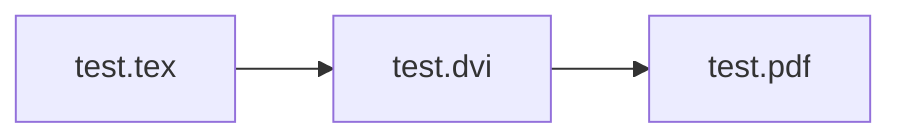

&nbsp;

:::message
今回の記事に対応する動画は以下からアクセスすることができます｡
__[TeX LiveとVSCodeをWindowsに導入して快適なLaTeX環境を構築する](https://togotv.dbcls.jp/20230301.html)__
:::
https://youtu.be/vKRxCpn2KbA?si=sqPKsRMgCgDwK_V6
:::message alert
本動画ではTeX Live 2022を用いています。2023年3月19日にTeX Live 2023がリリースされました。2022版と一部仕様変更があり、動画で紹介している内容が一部再現できなくなってるのでご注意ください。
:::


&nbsp;

# はじめに

:::message
__本記事の対象となる方__

■ $\LaTeX$を使ってレポートや論文を書きたい人
■ $\LaTeX$の執筆環境をローカルマシンに構築したい人
:::

この記事では、以下の2点をご紹介します。
__(1) WindowsマシンにTeX Liveを導入する__
__(2) VSCodeを用いてTeXファイルを編集、コンパイルする。__

&nbsp;

本記事を参考にすることで、ローカルマシンで$\LaTeX$の執筆やPDF作成を行えます。
OverleafやCloud LaTeXなどのオンラインサービスを使うこともできますが、安定したネット環境に接続していないと作業ができないというデメリットがあります。また、Overleafの無料ユーザーにはコンパイル時間のタイムリミットがあるため、大規模なファイルをコンパイルする際にはローカルマシンでの作業が必要になります。
参考：[Changes to free compile timeouts and servers](https://ja.overleaf.com/blog/changes-to-free-compile-timeouts-and-servers)

&nbsp;

# TeX Liveを導入する
今回はTeX Liveというソフトウェアをインストールして、$\LaTeX$環境を構築します。
現在、日本国内ではTeX Liveが最も普及していると思われます。
[日本語のWikiページ](https://texwiki.texjp.org/?TeX%20Live)や、各種解説記事も充実しているため、初心者の方でも導入しやすいと思います。今回解説する方法も、TeX Liveの公式サイトに掲載されている方法を参考にしています。

:::message alert
今回紹介する方法はネットワークインストーラを用います。インストールには安定したネットワーク接続が必要です。また、インストールには1時間から2時間ほどかかる場合があります。
ISOイメージを用いたインストール方法もありますので、ネットワーク接続が不安定な場合はそちらをご利用ください。
:::

### TeX Liveのインストーラーをダウンロードする
TeX Liveのインストーラーは、[Installing TeX Live over the Internet](https://www.tug.org/texlive/acquire-netinstall.html)からダウンロードすることができます。サイト内の `install-tl-windows.exe` をクリックしてダウンロードします。

### インストーラを開いてインストールの準備をする
インストーラを開く際に、`WindwosによってPCが保護されました` という警告が表示される場合があります。この場合は、`詳細情報` をクリックして、`実行` をクリックしてください。


ダウンロードしたインストーラを開くと、特定のミラーを選択する画面が表示されます。ここでは、`Asis` の項目で、`Japan` を選択します。これは、インストールするファイルをダウンロードするサーバーを選択するものです。日本国内のサーバーを選択することで、ダウンロード速度が向上します。

:::message alert
`Japan` 内のサイトであればどこでも構いませんが、セキュリティの観点から、`https://` から始まるものを選択することをおすすめします。
:::
&nbsp;
以下が、インストーラを開いた際の画面です。`TeXworksをインストール` からチェックを外します。今回はVSCodeを用いるため、TeXworksは不要です。また、`高度な設定` から詳細な設定を変更することができますが、デフォルトのままで問題ありません。


:::message
高度な設定からインストールするパッケージの量を変更することができます。デフォルトでは、`full スキーム（すべて）` となっています。このままでも問題ありませんが、インストール容量は多くなります。(7.5GBほど)
インストールするパッケージの量を減らしたい場合は適宜調整してください。
:::

:::message alert
`full スキーム（すべて）` 以外のものを選択した場合、日本語に対応させるパッケージが含まれていない場合があります。その場合は、`カスタマイズ` の言語欄から日本語を選択してください。
:::

## インストールを開始する
`インストール` を押すと、TeX Liveのインストールが始まります。インストールには1時間から2時間ほどかかる場合があります。その間、パソコンの電源を切ったり、ネットワーク接続を切断しないようにしてください。

# TeXファイルをコンパイルしてみる
## インストールが完了したことを確認する
正常なインストールが完了しているかをコマンドプロンプトで確認します。
```bash:コマンドプロンプト
latex
```
コマンドを実行した結果として、
```bash=
This is pdfTeX, Version 3.141592653-2.6-1.40.24 (TeX Live 2022) (preloaded format=latex)
 restricted \write18 enabled.
**
```
のように、バージョン情報が帰ってくれば正常にインストールが完了しています。
```bash:コマンドプロンプト
ctrl + c
```
を入力すると、`latex` コマンドを終了させることができます。

::::details インストールが正常に完了していないと思われる場合の対処法
- ネットワーク環境が不安定でないことを確認してもう一度実行する。
- ウイルス対策ソフトを一時的に無効にしてもう一度実行する。
:::message
上記の対処法でも解決しない場合は、[TeX Wiki内のインストール解説](https://texwiki.texjp.org/?TeX%20Live%2FWindows)の __トラブル時__ を参考にしてください。また、ISOイメージを用いたインストール方法に切り替えると解決する場合もあります。
:::
::::

## サンプルファイルをコンパイルしてみる
TeX Liveのインストールが完了したことを確認したら、サンプルファイルをコンパイルしてみましょう。サンプルファイル（test.tex）は、[動画の概要欄](https://togotv.dbcls.jp/20230301.html)からダウンロードすることができます。`platex` コマンドでコンパイルを行う場合、

という流れでpdfファイルを生成します。
まずは、中間ファイル（test.dvi）を生成するために以下のコマンドを実行します。
```bash:コマンドプロンプト
platex test.tex
```
実行した結果、test.dviが生成されていることを確認します。その後に、以下のコマンドを実行して、pdfファイルを生成します。
```bash:コマンドプロンプト
dvipdfmx test.dvi
```
このようにして、pdfファイルが生成されれば正常にコンパイルが完了しています。

# VSCodeで簡単にTeXファイルをコンパイルする

## VSCodeのインストールをする
## VSCodeにLaTeX Workshopをインストールする

